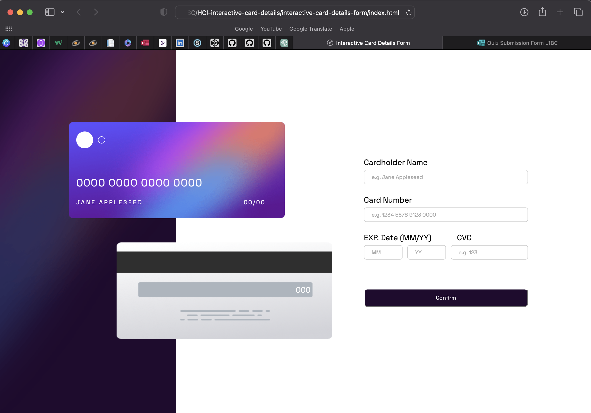

# Quiz 2 - Interactive card detail solution

This is a solution to the [Interactive card detail page Quiz 2 challenge]

## Table of contents

- [Overview](#overview)
  - [The challenge](#the-challenge)
  - [Screenshot](#screenshot)
  - [Links](#links)
- [My process](#my-process)
  - [Built with](#built-with)
  - [What I learned](#what-i-learned)
  - [Continued development](#continued-development)
  - [Useful resources](#useful-resources)
- [Author](#author)


## Overview

### The challenge

Users should be able to:

- Fill in the form and see the card details update in real-time
- Receive error messages when the form is submitted if:
  - Any input field is empty
  - The card number, expiry date, or CVC fields are in the wrong format
- View the optimal layout depending on their device's screen size
- See hover, active, and focus states for interactive elements on the page

### Screenshot




### Links

- Solution URL: [GitHub](https://github.com/CristovalNS/interactive-card-details-form)
- Live Site URL: [Add live site URL here](https://cristovalns.github.io/interactive-card-details-form/)

## My process

### Built with

- HTML
- CSS
- Flexbox
- JavaScript (Supposed to, but didn't have a chance to fully implement it.)


### What I learned

I learned the anxiety that comes with deadlines.

But in all seriousness, I've learned some new codes, such as:
- How to import custom assets from the internet using links

```css
@import url('https://fonts.googleapis.com/css2?family=Space+Grotesk&display=swap');
*{
    margin: 0;
    padding: 0;
    box-sizing: border-box;
    font-family: 'Space Grotesk', sans-serif;
}
```

- The :nth-child(n) selector matches every element that is the nth child of its parent. (Didn't get to use it sadly, as I didn't get to use JavaScript)
```css
#warning p:nth-child(1), #warning p:nth-child(2){
    width: 25%;
}
```


### Continued development

If I am continuing the development of this code, I would continue to invest time into the JavaScript file, as I did not have enough time to properly make a complete and functioning JavaScript code.

### Useful resources

There are plenty of useful resources from the internet, mostly from Geeks4Geeks, W3Schools, and tutorialspoint. However, I couldn't provide the exact link to the courses that I visted, as I closed them in stress.

## Your Detail 

- FullName - Cristoval Neo Sasono
- StudentID - 2602158235
- BINUS Email - cristoval.sasono@binus.ac.id

